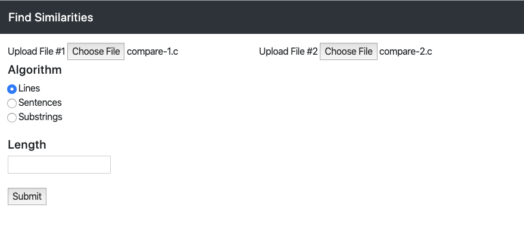
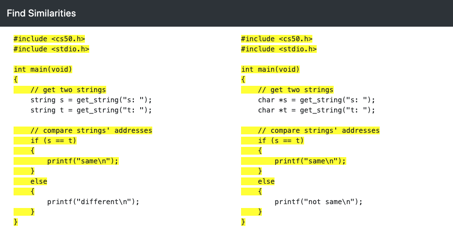
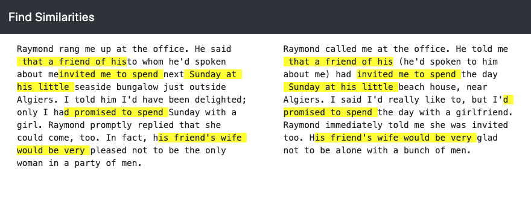

# find-similarities

Tool built in Python/Flask that takes in 2 text files (ascii-compatible) and returns the highlighted similarities.

This tool supports 3 algorithms:
* Lines - returns lines that are the same (useful for code comparisons)
* Sentences - returns sentences that are the same
* Substrings - returns substrings with a specified length that are the same

## Tools 

* Python 3.7.3 - The Back-End
* [Flask](http://flask.palletsprojects.com/en/1.1.x/) - The Web Framework used
* [BootStrap](https://getbootstrap.com/) - Front-End component 

## Screenshots





## Getting Started

These instructions will get you a copy of the project up and running on your local machine for development and testing purposes. 

### Prerequisites

You will need Python 3.x and the following libraries and packages. Type commands in terminal to install:

`pip install flask`

`pip install flask_session`

`pip install cs50`

### Installing

Download all files into a folder. Ensure that all imported libraries in `app.py` and `helpers.py` are 
installed on your machine or virtual environment.

Run the program on your machine or virtual environment.

```
flask run
```

## License / Copyright

* Completed as part of Harvard CS50 Curriculum
* This project is licensed under the MIT License.
